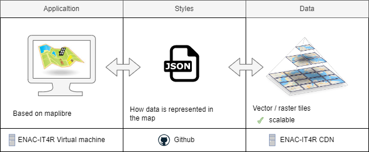

# EIRA data repository

This repository aims to store sample data for the project **EIRA - Enhancing Infrastructure Resilience to flooding using Afforestation: the
case of Nouakchott city, Mauritania**.

:rotating_light: GitHub limits the size of files allowed in repositories. If you attempt to add or update a file that is larger than 50 MB, you will receive a warning from Git.

## Architecture

The following architecture have been developed. 

## Data

All data have been transformed into vector tiles. Vector tiles are a way of storing and transmitting spatial data that is designed to be more efficient and flexible than traditional raster-based approaches.

Vector tiles are generated via a processing that can be run on demand. 

Raster tiles are not yet implemented (no data) .

## Style

= The way data is displayed, managed via json file. 

The styles can be found under the folder `style`of this repository. 

Currently, 3 styles have been designed : 

* with vector data only : [style_no_background.json](https://raw.githubusercontent.com/EPFL-ENAC/EIRA-data/main/Data_vector_style/style_no_background.json).

* With vector data + raster background : [style_raster_background.json](https://raw.githubusercontent.com/EPFL-ENAC/EIRA-data/main/Data_vector_style/style_raster_background.json).

* with vector data + vector backcround : [style_raster_vecor_background.json](https://raw.githubusercontent.com/EPFL-ENAC/EIRA-data/main/Data_vector_style/style_raster_vecor_background.json).

NB : 

* Background raster style can be chosen from this [app](http://leaflet-extras.github.io/leaflet-providers/preview/).

* The style can be visualized (and modified) via the [maputnik online tool](https://maputnik.github.io/editor/).

## Application

The webmap application is developed using an OpenSource webmap library. It displays the vector tiles data via the Json style file. 

 

